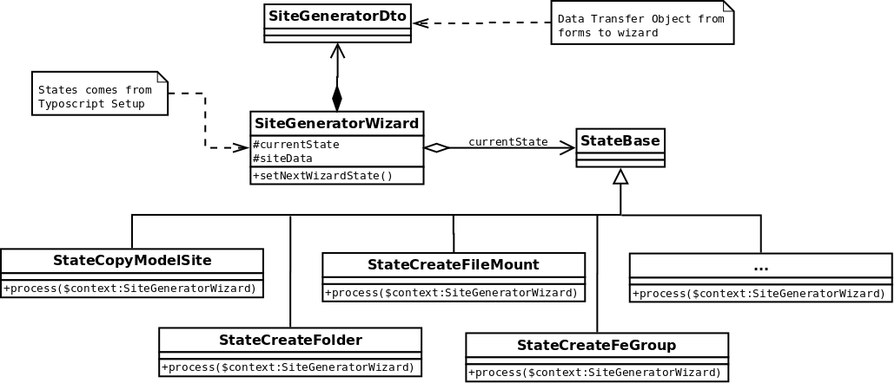

.. ==================================================
.. FOR YOUR INFORMATION
.. --------------------------------------------------
.. -*- coding: utf-8 -*- with BOM.

.. include:: ../Includes.txt

.. _developer:

================
Developer Corner
================

Target group: **Developers**

The **site_generator** extension is highly customizable, this chapter describes the basics of the extension and explain how to extend it in order to fit your own needs :

- add customs states
- add specific data to forms
- change wizard steps

The site_generator wizard is based on State Design Pattern :

   Site generator model

The wizard get states from **Typoscript Setup** and form data through **SiteGeneraorDto**.

For full customization, I suggest to create your own extension, this is how it is suppose to be in following section, the tree structure looks like this :

.. code-block:: none

   .
   ├── Classes
   │   ├── Dto
   │   │   └── SiteGeneratorDto.php
   │   ├── Slot
   │   │   └── SiteGeneratorSlot.php
   │   └── Wizard
   │       └── StateCreateFeGroup.php
   ├── composer.json
   ├── ext_emconf.php
   ├── ext_localconf.php
   ├── ext_typoscript_constants.typoscript
   ├── ext_typoscript_setup.typoscript
   └── Resources
       └── Private
           └── Templates
               └── SiteGenerator
                   ├── GetDataFirstStep.html
                   └── GetDataSecondStep.html

File details
============

.. toctree::
	:maxdepth: 3
	:titlesonly:
	:glob:

   Typoscript/Index
   Dto/Index
   SignalSlots/Index
   Templates/Index
   Wizard/Index
