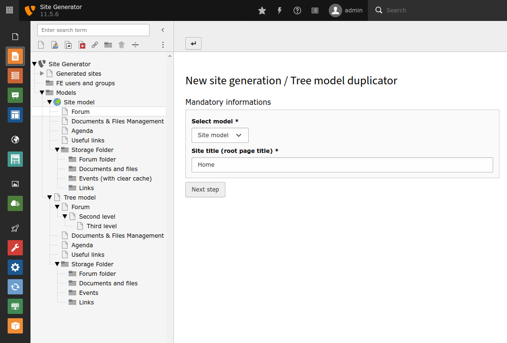

.. ==================================================
.. FOR YOUR INFORMATION
.. --------------------------------------------------
.. -*- coding: utf-8 -*- with BOM.

.. include:: ../Includes.txt

.. _introduction:

============
Introduction
============

.. _what-it-does:

What does it do?
================

This extension provide an easy way to create mini-websites or duplicate a tree in the backend.

Once the tree is duplicated, the extension will automatically :

* create associated BE/FE groups
* set access group for created tree
* create directories and files mount
* add domain name
* create site configuration
* update Typoscript configuration (folders/pages ID and TCEMAIN.clearCacheCmd)
* update slugs for URL rewriting

.. hint::
   The *site_generator* extension is highly customizable : you can remove unnecessary states and add your own states to fit your own needs.

.. _screenshots:

Screenshots
===========

Start the wizard
""""""""""""""""

.. figure:: ../Images/StartWizard.png
   :class: with-shadow
   :alt: Start the wizard

   Start the site generator wizard

Right click on a page specified by extension configuration to start the site generation process

Fill mandatory data
"""""""""""""""""""

   Set the mandatory data

Select the model (if required) and set first page title

Fill optional data
""""""""""""""""""

.. figure:: ../Images/SecondForm.png
   :class: with-shadow
   :alt: Second form

   Set the optional data

Set optional data (this step can be bypass with extension configuration)

Generation finished
"""""""""""""""""""

   Display a résumé of all steps

When the generation is finished, a résumé of all states is displayed

.. toctree::
   :maxdepth: 3
   :titlesonly:
   :glob:

   Support/Index
