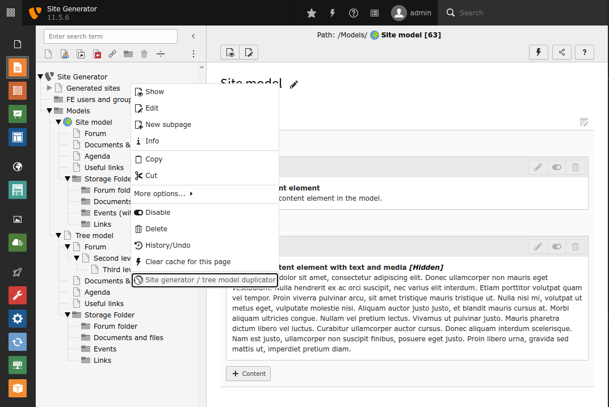

.. include:: /Includes.rst.txt

.. _introduction:

============
Introduction
============

.. _what-it-does:

What does it do?
================

This extension provide an easy way to create mini-websites or duplicate a tree in the backend.
For this purpose, the extension uses a :ref:`model <model>` that you defined according to your own needs which can be tailored through forms.

Once the model is duplicated, the extension will automatically :

* create associated BE/FE groups
* set access group for created tree
* create directories and files mount
* add domain name
* create site configuration
* update TypoScript configuration (folders/pages ID and TCEMAIN.clearCacheCmd)
* update slugs for URL rewriting

.. hint::
   The *site_generator* extension is highly customizable : you can remove unnecessary states and add your own states to fit your own needs.

.. _model:

What a model is ?
=================

A model is a dedicated parts of TYPO3 tree with pages, content elements, plugins, templates.

You can use as many models as you want.

.. _screenshots:

Screenshots
===========

Start the wizard
""""""""""""""""

   Start the site generator wizard

Right click on a page specified by extension configuration to start the site generation process

Fill mandatory data
"""""""""""""""""""

.. figure:: ../Images/FirstForm.png
   :class: with-shadow
   :alt: First form

   Set the mandatory data

Select the model (if required) and set first page title

Fill optional data
""""""""""""""""""

.. figure:: ../Images/SecondForm.png
   :class: with-shadow
   :alt: Second form

   Set the optional data

Set optional data (this step can be bypass with extension configuration)

Generation finished
"""""""""""""""""""

.. figure:: ../Images/Finish.png
   :class: with-shadow
   :alt: Generation finished

   Display a résumé of all steps

When the generation is finished, a résumé of all states is displayed

.. toctree::
   :maxdepth: 3
   :titlesonly:
   :glob:

   Support/Index
